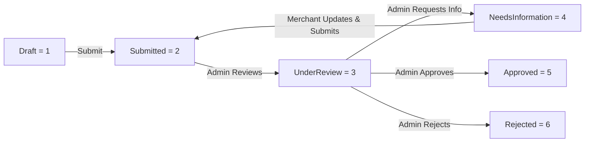

# DawwerOS Web API - Machine-Readable Documentation for AI Agents & Developers

Comprehensive, structured API reference designed for AI Agents, LLM tools, and client integrations interacting with the **DawwerOS Web API**.

---

## 1. System Overview & Core Specifications

- **Protocol**: `HTTPS` (Strict. Never send preflight or POST requests over plain `HTTP` to avoid preflight redirect errors).
- **Base URLs**:
  - **Production / Staging**: `https://dawwer.runasp.net/api`
  - **Local Development**: `https://localhost:7212/api` (or `http://localhost:5037/api`)
- **Default Content-Type**: `application/json; charset=utf-8` (except document uploads which use `multipart/form-data`).
- **Interactive Swagger Explorer**:
  - Production: `https://dawwer.runasp.net/swagger`
  - Local: `https://localhost:7212/swagger`
- **CORS Configuration**: Supports all origins with credentials, all headers, and standard HTTP methods.

---

## 2. Universal API Envelope (`ApiResponse<T>`)

Every endpoint across the entire API returns a standardized JSON envelope. Agents must parse this wrapper to verify success and read the payload or error details.

### Success Response Envelope
```json
{
  "success": true,
  "message": "Operation completed successfully.",
  "data": { ... },
  "errors": null
}
```

### Failure / Validation Response Envelope
```json
{
  "success": false,
  "message": "Validation failed.",
  "data": null,
  "errors": [
    "Email address is required.",
    "Password must contain at least one uppercase letter, one lowercase letter, one digit, and one special character."
  ]
}
```

### HTTP Status Code Semantics
- `200 OK`: Request succeeded. Envelope contains `data`.
- `201 Created`: Resource successfully created. Returns resource details and `Location` header.
- `400 Bad Request`: Payload validation failed or domain rule violated. Check `message` and `errors`.
- `401 Unauthorized`: Missing, expired, or revoked JWT Bearer token.
- `403 Forbidden`: Authenticated user lacks required platform role or store permission.
- `404 Not Found`: Target entity does not exist or user lacks access rights.
- `429 Too Many Requests`: Client exceeded the rate limit (Auth window: 30 req/min in prod, 200 in dev).
- `500 Internal Server Error`: Unhandled server exception.

---

## 3. Authentication, Tokens & Authorization

### 3.1 Authentication Mechanism
- Standard **JWT Bearer Token** passed in the HTTP `Authorization` header:
  ```http
  Authorization: Bearer <accessToken>
  ```
- **Token Invalidation**: Server maintains a revocation list by `jti` (JWT ID). Tokens are also invalidated upon logout, account suspension, or password changes.
- **Refresh Flow**: Refresh tokens are single-use / rotated to renew expired access tokens without re-authenticating credentials.

### 3.2 User Roles (`UserRole`)
| Role | Integer Value | Description |
|---|---|---|
| `Customer` | `1` | End consumers who browse products, place orders, and manage personal profile. |
| `Merchant` | `2` | Business owners who create store applications, manage stores, and assign staff. |
| `Staff` | `3` | Store employees assigned to a merchant's store with fine-grained permissions. |
| `Admin` | `4` | Platform operators with global governance, store review, taxonomy, and audit oversight. |

### 3.3 User Account Status (`UserStatus`)
| Status | Integer Value | Description |
|---|---|---|
| `PendingVerification` | `1` | Newly registered; requires 6-digit email/SMS verification code. |
| `Active` | `2` | Fully verified and active. |
| `Suspended` | `3` | Blocked by platform admin; active JWT tokens rejected. |
| `Inactive` | `4` | Deactivated by user or system. |

### 3.4 Multi-Tenant Store Context Switching (`SelectStore`)
When an authorized user (`Merchant` or `Staff`) operates on a specific store, they call `POST /api/Auth/select-store` with `storeId`.
The backend issues a store-scoped token embedding:
- `storeId`: Active Store GUID
- `storePermissions`: Comma-separated granular permission codes granted to the user in that store.

### 3.5 Fine-Grained Store Permissions (`StorePermissions`)
Used with the `[RequireStorePermission(...)]` attribute on store-scoped endpoints:
- `Products.View`: View products and inventory in the store.
- `Products.Manage`: Create, update, or delete products.
- `Inventory.View`: View stock levels and inventory alerts.
- `Inventory.Manage`: Adjust stock, track warehouses, and manage lots.
- `Orders.View`: Inspect customer orders and fulfillment states.
- `Orders.Manage`: Update order status, process refunds, and modify shipments.
- `Staff.Manage`: Invite, update, remove staff, and manage custom roles.
- `Store.Manage`: Modify store branding, settings, and business metadata.

---

## 4. Complete Endpoint Reference

### 4.1 Authentication Endpoints (`/api/Auth`)

| Method | Endpoint | Auth | Description |
|---|---|---|---|
| `POST` | `/api/Auth/register` | Anonymous | Registers a new Customer or Merchant. Dispatches 6-digit verification code. |
| `POST` | `/api/Auth/verify-code` | Anonymous | Verifies account using 6-digit code. Activates account upon success. |
| `POST` | `/api/Auth/resend-code` | Anonymous | Re-sends account verification code. |
| `POST` | `/api/Auth/login` | Anonymous | Authenticates with email & password. Returns JWT + refresh token. |
| `POST` | `/api/Auth/refresh-token` | Anonymous | Exchanges refresh token for new access & refresh tokens. |
| `GET` | `/api/Auth/me` | Bearer Token | Retrieves current user claims and identity context from JWT. |
| `POST` | `/api/Auth/forgot-password` | Anonymous | Sends password reset token to user's registered email. |
| `POST` | `/api/Auth/reset-password` | Anonymous | Resets password using verification token. |
| `POST` | `/api/Auth/logout` | Bearer Token | Revokes JWT `jti` and invalidates active refresh tokens. |
| `POST` | `/api/Auth/select-store` | Bearer Token | Switches active store context and issues store-scoped JWT token. |

#### Request & Response Schemas:

##### `POST /api/Auth/register`
- **Request Body**:
  ```json
  {
    "fullName": "Ahmed Ali",
    "email": "ahmed@example.com",
    "phoneNumber": "+966501234567",
    "password": "StrongPassword123!",
    "role": 1
  }
  ```
  *Validation Rules*:
  - `fullName`: Required, 2-100 characters.
  - `email`: Required, valid email format, max 256 characters.
  - `phoneNumber`: Optional, valid phone format, max 30 characters.
  - `password`: Required, min 8 characters, must include 1 uppercase, 1 lowercase, 1 number, 1 special character (`^(?=.*[a-z])(?=.*[A-Z])(?=.*\d)(?=.*[\W_]).{8,}$`).
  - `role`: Optional (Default: `1` Customer, `2` Merchant).
- **Response `data`**:
  ```json
  {
    "userId": "3fa85f64-5717-4562-b3fc-2c963f66afa6",
    "email": "ahmed@example.com",
    "fullName": "Ahmed Ali",
    "status": "PendingVerification",
    "verificationCodeExpiresAt": "2026-09-15T12:00:00Z"
  }
  ```

##### `POST /api/Auth/verify-code`
- **Request Body**:
  ```json
  {
    "email": "ahmed@example.com",
    "code": "123456",
    "codeType": 1
  }
  ```
  *Enums (`VerificationCodeType`)*: `EmailVerification = 1`, `PhoneVerification = 2`, `PasswordReset = 3`.
- **Response `data`**:
  ```json
  {
    "verified": true,
    "userId": "3fa85f64-5717-4562-b3fc-2c963f66afa6",
    "message": "Account verified successfully."
  }
  ```

##### `POST /api/Auth/login`
- **Request Body**:
  ```json
  {
    "email": "ahmed@example.com",
    "password": "StrongPassword123!"
  }
  ```
- **Response `data`**:
  ```json
  {
    "userId": "3fa85f64-5717-4562-b3fc-2c963f66afa6",
    "fullName": "Ahmed Ali",
    "email": "ahmed@example.com",
    "phoneNumber": "+966501234567",
    "role": "Customer",
    "accessToken": "eyJhbGciOi...",
    "refreshToken": "d8a7c2b4...",
    "expiresAt": "2026-09-15T14:30:00Z"
  }
  ```

##### `POST /api/Auth/select-store`
- **Request Body**:
  ```json
  {
    "storeId": "7b8f6a91-45c2-48df-bc88-825dfa234123"
  }
  ```
- **Response `data`**:
  ```json
  {
    "storeId": "7b8f6a91-45c2-48df-bc88-825dfa234123",
    "storeName": "Green Tech Store",
    "roleName": "Store Manager",
    "permissions": ["Products.View", "Products.Manage", "Inventory.View", "Orders.View"],
    "storeToken": "eyJhbGciOi..."
  }
  ```

---

### 4.2 Public Catalog & Store Discovery

#### 4.2.1 Categories (`/api/categories`)
| Method | Endpoint | Auth | Description |
|---|---|---|---|
| `GET` | `/api/categories` | Anonymous | Get flat list of active categories. Query: `search` |
| `GET` | `/api/categories/tree` | Anonymous | Get full active category hierarchy tree. |
| `GET` | `/api/categories/{id}` | Anonymous | Get active category details by GUID. |

##### Category Tree Response Item (`CategoryTreeResponseDto`):
```json
{
  "id": "e4f8d2a1-62d9-4fa2-9387-578b1234abcd",
  "name": "Electronics",
  "slug": "electronics",
  "description": "Electronic devices and accessories",
  "iconUrl": "https://...",
  "isActive": true,
  "displayOrder": 1,
  "children": [
    {
      "id": "c1a2b3d4-...",
      "name": "Smartphones",
      "slug": "smartphones",
      "parentId": "e4f8d2a1-62d9-4fa2-9387-578b1234abcd",
      "children": []
    }
  ]
}
```

#### 4.2.2 Public Stores (`/api/stores`)
| Method | Endpoint | Auth | Description |
|---|---|---|---|
| `GET` | `/api/stores` | Anonymous | Browse approved/active stores. Query: `city`, `search`, `page` (def 1), `pageSize` (def 20). |
| `GET` | `/api/stores/{id}` | Anonymous | Get public store details. Returns 404 if inactive or not approved. |

---

### 4.3 Authenticated User Profile (`/api/Profile`)

Requires `Authorization: Bearer <token>`.

| Method | Endpoint | Description |
|---|---|---|
| `GET` | `/api/Profile` | Retrieves authenticated user profile details. |
| `PUT` | `/api/Profile` | Updates editable profile fields (`fullName`, `phoneNumber`, `email`). |
| `POST` | `/api/Profile/change-password` | Changes password. Invalidates all existing sessions. |

#### Request Schemas:
##### `PUT /api/Profile`
```json
{
  "fullName": "Ahmed Ali Updated",
  "phoneNumber": "+966509999999",
  "email": "ahmed.new@example.com"
}
```
##### `POST /api/Profile/change-password`
```json
{
  "currentPassword": "OldPassword123!",
  "newPassword": "NewStrongPassword456!"
}
```

---

### 4.4 Merchant Store Application & Management (`/api/merchant/stores`)

Requires `Authorize(Roles = "Merchant,Admin")`.

| Method | Endpoint | Description |
|---|---|---|
| `POST` | `/api/merchant/stores` | Create a new draft store application. |
| `PUT` | `/api/merchant/stores/{id}` | Update application while in `Draft` or `NeedsInformation` status. |
| `GET` | `/api/merchant/stores` | List all applications belonging to the authenticated merchant. |
| `GET` | `/api/merchant/stores/{id}` | Get application details by GUID. |
| `POST` | `/api/merchant/stores/{id}/documents` | Upload required verification document (`multipart/form-data`). |
| `DELETE` | `/api/merchant/stores/{id}/documents/{documentId}` | Delete an uploaded document from draft application. |
| `POST` | `/api/merchant/stores/{id}/submit` | Submit draft application for admin review. |

#### Store Verification Lifecycle (`StoreVerificationStatus`):


#### Document Types (`StoreDocumentType`):
- `1` = `CommercialRegister`
- `2` = `TaxCard`
- `3` = `StoreLicense`
- `4` = `IdentityDocument`
- `5` = `Other`

#### Request Schemas:
##### `POST /api/merchant/stores`
```json
{
  "name": "Al-Amal Electronics",
  "description": "Authorized dealer for smart devices",
  "commercialRegistrationNumber": "1010123456",
  "taxNumber": "300012345600003",
  "phoneNumber": "+966112223344",
  "email": "info@alamal.com",
  "address": "King Fahd Road, Riyadh",
  "city": "Riyadh",
  "latitude": 24.7136,
  "longitude": 46.6753,
  "logoUrl": "https://assets.dawwer.com/logos/alamal.png",
  "coverImageUrl": "https://assets.dawwer.com/covers/alamal.png"
}
```

##### `POST /api/merchant/stores/{id}/documents`
- `Content-Type`: `multipart/form-data`
- Form fields:
  - `file`: binary file payload (PDF, PNG, JPG)
  - `documentType`: integer (e.g. `1` for CommercialRegister)

---

### 4.5 Store Staff & Access Control (`/api/stores/{storeId}/...`)

Requires `Authorize(Roles = "Admin,Merchant,Staff")` and `RequireStorePermission(StorePermissions.ManageStaff)`.

#### 4.5.1 Staff Management (`/api/stores/{storeId}/staff`)
| Method | Endpoint | Description |
|---|---|---|
| `GET` | `/api/stores/{storeId}/staff` | List staff members assigned to this store. |
| `POST` | `/api/stores/{storeId}/staff` | Invite/add a new staff member to this store. |
| `GET` | `/api/stores/{storeId}/staff/{staffId}` | Get staff member details. |
| `PUT` | `/api/stores/{storeId}/staff/{staffId}` | Update staff operational status or custom permissions. |
| `DELETE` | `/api/stores/{storeId}/staff/{staffId}` | Remove staff member from the store. |
| `POST` | `/api/stores/{storeId}/staff/{staffId}/role` | Assign or switch staff role. |

##### Staff Invitation Payload (`AddStoreStaffRequestDto`):
```json
{
  "email": "employee@store.com",
  "fullName": "Salim Mansour",
  "phoneNumber": "+966551122334",
  "storeRoleId": "91a82f34-11bc-4981-b203-883a9921ef10",
  "temporaryPassword": "TempPassword123!",
  "customGrantedPermissions": ["Orders.Manage"],
  "customRevokedPermissions": ["Staff.Manage"]
}
```

#### 4.5.2 Store Roles & Permissions (`/api/stores/{storeId}/roles`)
| Method | Endpoint | Description |
|---|---|---|
| `GET` | `/api/stores/{storeId}/roles` | Get all system presets and custom store roles. |
| `POST` | `/api/stores/{storeId}/roles` | Create a custom role with selected permissions. |
| `PUT` | `/api/stores/{storeId}/roles/{roleId}` | Update an existing custom store role. |
| `GET` | `/api/stores/{storeId}/roles/permissions` | Get catalog of all granular permission codes for UI matrices. |

##### Create Store Role Payload (`CreateStoreRoleRequestDto`):
```json
{
  "name": "Order Dispatcher",
  "description": "Responsible for managing and fulfilling customer orders",
  "permissionCodes": [
    "Orders.View",
    "Orders.Manage",
    "Inventory.View"
  ]
}
```

---

### 4.6 Platform Administration (`/api/admin/...`)

Strictly restricted to `Authorize(Roles = "Admin")`.

#### 4.6.1 User Account Administration (`/api/admin/users`)
| Method | Endpoint | Description |
|---|---|---|
| `GET` | `/api/admin/users` | Paginated user directory. Query: `role`, `status`, `search`, `page`, `pageSize`. |
| `GET` | `/api/admin/users/{id}` | Detailed user profile and activity status. |
| `POST` | `/api/admin/users/{id}/suspend` | Suspends user, kills active sessions, writes audit log. Optional body: `{"reason": "Fraudulent activity"}` |
| `POST` | `/api/admin/users/{id}/activate` | Reactivates suspended user account. |

#### 4.6.2 Store Verification & Moderation (`/api/admin/stores`)
| Method | Endpoint | Description |
|---|---|---|
| `GET` | `/api/admin/stores/applications` | Review queue. Query: `status`, `page`, `pageSize`. |
| `GET` | `/api/admin/stores/applications/{id}` | Application details with attached documents. |
| `POST` | `/api/admin/stores/applications/{id}/start-review` | Marks application `UnderReview`. |
| `POST` | `/api/admin/stores/applications/{id}/request-info` | Sets `NeedsInformation`. Body: `{"message": "Please attach official tax certificate"}`. |
| `POST` | `/api/admin/stores/applications/{id}/approve` | Approves store. Activates store for public listing. |
| `POST` | `/api/admin/stores/applications/{id}/reject` | Rejects application. Body: `{"reason": "Invalid registration documents"}`. |
| `POST` | `/api/admin/stores/{id}/suspend` | Suspends an active approved store. Body: `{"reason": "Policy violation"}`. |
| `POST` | `/api/admin/stores/{id}/activate` | Reactivates a suspended store. |

#### 4.6.3 Taxonomy Governance (`/api/admin/categories`)
| Method | Endpoint | Description |
|---|---|---|
| `GET` | `/api/admin/categories` | List all categories including inactive ones. Query: `isActive`, `search`. |
| `GET` | `/api/admin/categories/tree` | Hierarchical category tree including inactive nodes. |
| `GET` | `/api/admin/categories/{id}` | Get category by ID. |
| `POST` | `/api/admin/categories` | Create category or subcategory (`parentId` optional). |
| `PUT` | `/api/admin/categories/{id}` | Update category metadata, display order, or parent node. |
| `DELETE` | `/api/admin/categories/{id}` | Delete category (only if it has no child categories). |
| `PATCH` | `/api/admin/categories/{id}/activate` | Activate category. |
| `PATCH` | `/api/admin/categories/{id}/deactivate` | Deactivate category. |

##### Create Category Payload (`CreateCategoryRequestDto`):
```json
{
  "name": "Smart Watches",
  "slug": "smart-watches",
  "description": "Wearable devices and accessories",
  "parentId": "e4f8d2a1-62d9-4fa2-9387-578b1234abcd",
  "iconUrl": "https://assets.dawwer.com/icons/smartwatch.svg",
  "displayOrder": 2,
  "isActive": true
}
```

#### 4.6.4 Security Audit Logs (`/api/admin/audit-logs`)
Immutable log of administrative, identity, and security operations.
| Method | Endpoint | Description |
|---|---|---|
| `GET` | `/api/admin/audit-logs` | Query audit trail. Query: `userId`, `storeId`, `action`, `entityType`, `startDate`, `endDate`, `page`, `pageSize`. |
| `GET` | `/api/admin/audit-logs/{id}` | Single audit record with old/new values diff payload. |

---

### 4.7 Infrastructure & Health (`/api/Health`)
- `GET /api/Health` (Anonymous): Validates API availability and PostgreSQL database connectivity.
- **Response `data`**:
  ```json
  {
    "status": "Healthy",
    "database": "Connected",
    "timestamp": "2026-09-15T12:55:00Z"
  }
  ```

---

## 5. Agent Implementation Checklist & Best Practices

1. **Protocol & Port Enforcement**:
   - Always target `https://` when sending requests to `dawwer.runasp.net`.
   - Never use `http://` as HTTP-to-HTTPS redirects cause browser CORS preflight (`OPTIONS`) failures.
2. **Payload Serialization**:
   - Ensure `Content-Type: application/json` is explicitly present on all `POST`/`PUT` requests.
   - Always `JSON.stringify(payload)` when using `fetch`.
3. **Store Context Flow**:
   - For store-specific operations (staff management, orders, products), first invoke `/api/Auth/select-store` to retrieve the store-scoped token with required `storePermissions`.
4. **Token Refresh Algorithm**:
   - When receiving `401 Unauthorized`, invoke `POST /api/Auth/refresh-token` with `{ "accessToken": "...", "refreshToken": "..." }`.
   - If refresh returns `400` or `401`, redirect to re-login.
5. **Handling Model Validation**:
   - Upon `400 Bad Request`, inspect `response.errors` array to parse field-specific validation failures.
